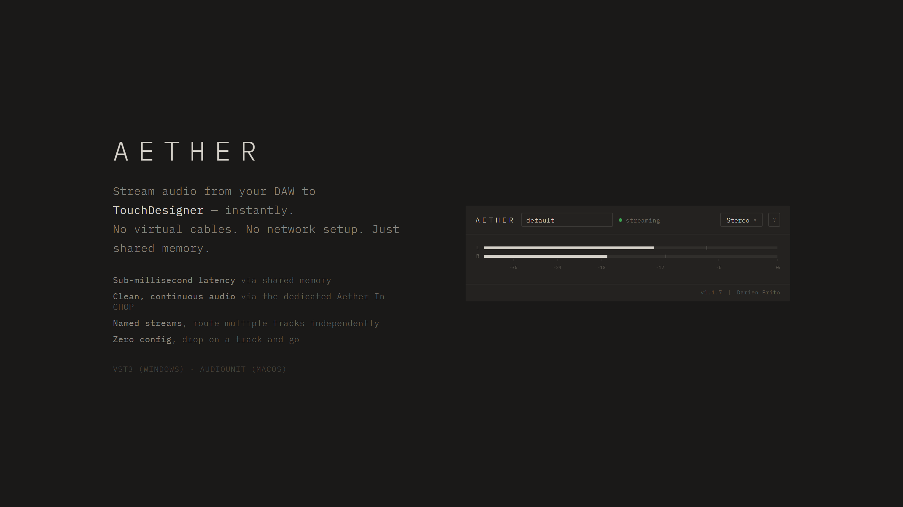

# Aether Issue Tracker

This repository is the public issue tracker for **Aether**, a shared memory audio bridge plugin for DAWs and TouchDesigner.

Aether is a VST3 (Windows) / VST3 + AudioUnit (macOS) plugin that streams real-time audio from your DAW to TouchDesigner via shared memory. Drop it on any track and your audio is instantly available in TD through the included **Aether In** CHOP.

## Reporting a bug

Please use the **Bug Report** template and include:

- Your OS, DAW, and TouchDesigner version
- The Aether version you're using (shown in the plugin footer)
- Steps to reproduce the issue
- Any relevant screenshots or logs

## Requesting a feature

Use the **Feature Request** template to suggest improvements. Describe the problem you're solving and how you imagine it working.

## Quick setup reference

1. Run the installer. It installs the plugin and the **Aether In** CHOP for TouchDesigner.
2. Load **Aether** as an audio effect on any track in your DAW.
3. Set a **stream name** (or keep `default`).
4. In TouchDesigner, add an **Aether In** CHOP and set its **Stream Name** to match. For visuals-only pipelines, TD's built-in **Shared Mem In** CHOP also works (set **Segment Name** to the stream name).
5. Play audio. It appears in TD instantly.

Plugin settings:

| Setting | Options | Default |
|---------|---------|---------|
| Stream  | Any name | `default` |
| Channel | Stereo / Mono L / Mono R / Mono Mix | Stereo |

## Latency

Latency is set on the receiving side by the **Prefill** parameter of the Aether In CHOP (the cushion of frames it keeps buffered). The plugin adds no buffering of its own.

Prefill is measured in frames, so wall-clock latency depends on your session's sample rate: `latency in seconds = Prefill / sample rate`. The stream always runs at whatever rate your DAW is set to, and the plugin's help overlay (Latency tab) computes these values live for your current session.

| Prefill | At 44.1 kHz | At 48 kHz | Use case |
|---------|-------------|-----------|----------|
| 2048    | ~46 ms      | ~43 ms    | Robust default, survives TD frame stalls |
| 1024    | ~23 ms      | ~21 ms    | Low latency for steady 60 fps networks |
| 512     | ~12 ms      | ~11 ms    | Needs a consistently steady TD frame rate |
| 256     | ~6 ms       | ~5 ms     | Minimum, underrun-prone |

To measure your actual latency, attach an Info CHOP to Aether In: `buffered / sample rate` gives seconds.

## Download

- [Get Aether on Gumroad](https://darienbrito.gumroad.com/l/aether)
- [Support development on Patreon](https://www.patreon.com/cw/darienbrito)

## Note

This repository contains no source code. It exists solely for community bug reports and feature requests.
